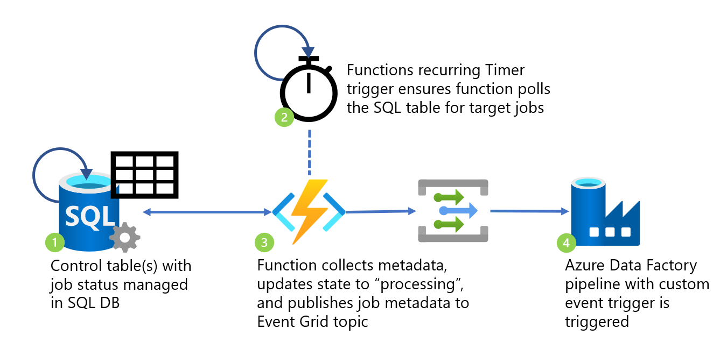

# sql-azure-functions-adf-event-trigger

## Overview

Metadata driven frameworks are very common in ETL scenarios - they make it faster to develop processes and provide more flexibility when processing data in your system. There are lots of ways to build and orchestrate these processes - Azure Data Factory has a [metadata-driven copy wizard](https://docs.microsoft.com/azure/data-factory/copy-data-tool-metadata-driven) you can use to quickly build data movement pipelines, Microsoft MVP Paul Andrew has built an [open source metadata framework on top of Data Factory called adf.procfwk](https://mrpaulandrew.com/2020/08/17/adf-procfwk-v1-8-5-execution-precursor/), and many organisations build and maintain their own custom metadata-driven frameworks too.

I worked on a data warehouse migration project earlier this year which involved modernizing key portions of the workload from SSIS and SQL Server into Azure. This included extending the existing metadata-driven ETL framework to operate in the new cloud architecture. The project was a success and I learned a lot about migrating and modernizing complex data systems; unfortunately end-to-end job performance in the new cloud environment was degraded. We knew what the root cause of this issue was - a mix of insufficient bandwidth between on premises and cloud, and some shortcuts I made during the implementation phase to extract job metadata from the custom framework.

What were those shortcuts? Without getting too bogged down in the detail, the metadata parsing and job triggering was implemented in a data factory pipeline which, at it's highest frequency, could only be triggered _once every minute_. This was a stark difference to the original system which ran multiple times a second (!). I knew a more lightweight event-driven solution was possible, but ran out of time to implement it in the scope of the project. Naturally, this has been bugging me ever since - so I found some time over the last few weeks to re-visit and solve the problem.

### Solution architecture

[Azure SQL bindings for Azure Functions](https://techcommunity.microsoft.com/t5/azure-sql-blog/introduction-to-azure-sql-bindings-for-azure-functions-data/ba-p/3074172) was announced in preview at the beginning of this year and I always thought this would form part of the solution. Unfortunately you can't yet trigger a function on updates to a table - only input and output bindings are supported, but that's enough for a working solution:

#### Processing flow

1. Metadata control table(s) with job status managed in SQL DB. SQL Server Agent Job manages job provisioning.
1. Azure Functions recurring Timer trigger ensures function polls the SQL table for target jobs event-driven processes.
1. Azure Function collects jobs from metadata table in “Started” state, updates state to “processing”, and publishes an event with job metadata to Event Grid topic.
1. Azure Data Factory pipeline with custom event trigger is triggered, parsing metadata from inbound event for use in pipeline.

For a more detailed runthrough of how to implement this in your own environment, please see [this blog post](https://joeplumb.com/blog/custom-event-driven-etl-with-sql-azure-functions-event-grid/).